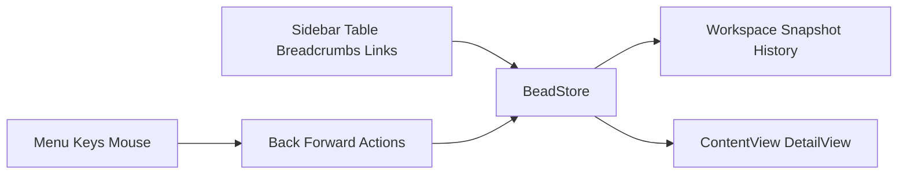

# Requirements

### Overview & Goals
Add native workspace history so users can move backward and forward through bead navigation in the existing macOS sidebar-list-detail app. A typical flow like opening a bead, jumping to a child bead, then pressing the mouse Back button twice should return to the earlier screens step-by-step; Forward should replay those steps.

### Scope
#### In Scope
- Back/forward navigation for the main workspace driven by the current `NavigationSplitView` shell in `Sources/Beadazzle/Views/ContentView.swift`.
- Recording history for navigation that currently changes workspace state via `BeadStore`, including:
  - sidebar bookmark changes from `Sources/Beadazzle/Views/SidebarView.swift`
  - issue selection from `Sources/Beadazzle/Views/IssueListTableView.swift`
  - breadcrumb/list-return actions in `Sources/Beadazzle/Views/IssueBreadcrumbViews.swift` and `Sources/Beadazzle/Views/GateDetailView.swift`
  - cross-links such as `store.revealIssue(id:)` in `Sources/Beadazzle/Views/DependenciesView.swift`
- Standard keyboard shortcuts and menu commands for Back/Forward.
- Native mouse back/forward button support.
- Accessibility-safe controls and labels for the exposed commands.
- An internal action/binding shape that can support future shortcut customization.

#### Out of Scope
- Replacing the app’s desktop shell with `NavigationStack`.
- Persisting history across launches or project switches.
- A settings UI for shortcut customization.
- Capturing transient per-field edit buffers for existing-bead edit forms; history focuses on workspace navigation state.

### Functional Requirements
- The app must maintain a linear session history for the main workspace.
- A history step must restore full workspace context for navigation purposes: bookmark, selection/detail target, search/filter state, sort/list mode, and outline expansion state.
- Repeated navigation to the same visible state must not create duplicate adjacent history entries.
- After going Back, taking a new navigation action must clear the forward stack.
- Search/filter state should be restored with a screen, but filter typing must not spam the history with one entry per keystroke.
- Menu items and keyboard shortcuts must enable/disable to reflect whether Back or Forward is currently available.
- Mouse back/forward buttons must trigger the same underlying actions as the menu/keyboard commands.

### Non-Functional Requirements
- Preserve the current performant table/list behavior centered on `IssueListTableView.swift`; history should reuse existing `BeadStore` state instead of rebuilding navigation around `NavigationLink`.
- Keep AppKit interop narrow and limited to platform edges, consistent with existing wrappers like `IssueKeyboardTableView` and `ProjectSearchNSTextField`.
- Keep behavior accessible by using standard `Button`-backed commands, clear titles, and native shortcut exposure in the menu bar.

# Technical Design

### Current Implementation
- `Sources/Beadazzle/Views/ContentView.swift` owns the workspace shell with `NavigationSplitView` and an `HSplitView` detail area.
- `Sources/Beadazzle/Stores/BeadStore.swift` is the authoritative `@Observable` model for bookmark selection, issue selection, filters, sort state, list mode, outline expansion, and most side data.
- The detail route is derived from state rather than a push path:
  - `DetailView.swift` chooses between creation, bulk detail, gate detail, issue detail, or empty state from `selectedIDs` plus `creationDraft`.
- Navigation is currently multi-source and mostly imperative:
  - `IssueListTableView.swift` writes selection with `store.select(_:)`
  - `DependenciesView.swift` calls `store.revealIssue(id:)`
  - `GateDetailView.swift` selects blocked beads directly
  - `IssueBreadcrumbViews.swift` uses `store.clearSelection()`
  - `SidebarView.swift` switches `selectedBookmark`
- App-level commands live in `Sources/Beadazzle/App/BeadazzleApp.swift`, with similar focused-action plumbing already used by `BeadSaveCommands.swift` and `BeadNavigationCommands.swift`.

### Key Decisions
- **Keep `NavigationSplitView`; do not retrofit `NavigationStack` as the primary navigation model.** The app is already selection-driven and relies on a custom AppKit-backed table for performance.
- **Make history store-owned.** `BeadStore` already owns the navigation-relevant state, so it is the right place to capture/restore snapshots and expose `goBack()` / `goForward()`.
- **Record full workspace snapshots at meaningful navigation boundaries.** Each entry will carry bookmark, selection/detail target, search/filter state, sort/list mode, and outline expansion; filter/search changes are captured as part of a screen snapshot rather than always creating standalone entries.
- **Route all input methods through the same history actions.** Menu commands, keyboard shortcuts, breadcrumbs, jump links, and mouse buttons must all converge on one history engine to stay correct and customizable later.
- **Use AppKit only for the mouse-button edge.** Like `IssueKeyboardTableView` and `ProjectSearchNSTextField`, the extra mouse button handling should be a narrow bridge layered on top of SwiftUI.

### Proposed Changes
1. **Introduce workspace snapshot models and history state**
   - Add a small support/model type such as `BeadWorkspaceSnapshot` / `BeadHistoryState` to represent the restorable workspace.
   - Track `backStack`, `currentSnapshot`, and `forwardStack` (or equivalent cursor-based storage) inside `BeadStore`.
   - Add deduping so consecutive equal snapshots do not accumulate.

2. **Centralize restore/apply logic in `BeadStore`**
   - Add methods like `goBack()`, `goForward()`, `canGoBack`, `canGoForward`, and `recordNavigationSnapshot(...)`.
   - Add a guarded restore path that reapplies snapshot state without recursively recording a new entry.
   - Reuse existing helpers such as `applyFilters()`, `rebuildIssueListRows()`, `expandAncestorsForSelection()`, and side-data refresh scheduling.

3. **Move creation-state ownership to the same layer if needed for complete snapshots**
   - `ContentView.swift` currently owns `creationDraft`; the cleanest way to include “new bead” screens in history is to move that state behind `BeadStore` or a companion store-owned navigation model.
   - Keep `closeBeadRequest` as transient presentation state outside history.

4. **Register history at navigation-producing entry points**
   - Update `select(_:)`, `clearSelection()`, `revealIssue(id:)`, and `applyBookmark(_:)` in `BeadStore.swift` to record navigation transitions.
   - Keep non-navigation refreshes and side-data loads from polluting history.
   - Preserve the current behavior where bookmark changes clear detail selection, but now as a restorable screen transition.

5. **Replace the single “Back to Beads” command shape with explicit Back/Forward actions**
   - Evolve `BeadNavigationCommands.swift` or replace it with a small action set that can represent both directions.
   - Update `BeadazzleApp.swift`’s `Navigate` menu to expose `Back` and `Forward` with standard shortcuts, while keeping the existing expand/collapse children commands.
   - Keep shortcut resolution centralized so later customization can swap bindings without rewriting the command handlers.

6. **Add a workspace-level mouse-button bridge**
   - Introduce a narrow AppKit bridge, likely attached from `ContentView.swift`, that observes local `otherMouseDown` events for the workspace window and routes mouse Back/Forward buttons to store actions.
   - Avoid global ownership of history in the bridge; it should only dispatch input.

### Data Models / Contracts
```swift
struct BeadWorkspaceSnapshot: Equatable {
    var bookmark: BeadBookmark
    var selectedIDs: Set<String>
    var searchText: String
    var statusFilters: Set<String>
    var typeFilters: Set<String>
    var priorityFilters: Set<Int>
    var labelFilters: Set<String>
    var sort: IssueSort
    var sortDirection: SortDirection
    var issueListMode: IssueListMode
    var collapsedIssueIDs: Set<String>
    var creationDraft: IssueDraft?
}
```

```swift
@MainActor
extension BeadStore {
    var canGoBack: Bool { ... }
    var canGoForward: Bool { ... }
    func goBack()
    func goForward()
    func recordNavigationSnapshotIfNeeded()
    func restoreWorkspace(_ snapshot: BeadWorkspaceSnapshot)
}
```

### Components
- `BeadStore.swift` — primary history owner and snapshot restore engine.
- `ContentView.swift` — workspace bridge attachment point and possible migration of `creationDraft` ownership.
- `BeadazzleApp.swift` — Back/Forward menu commands and default shortcuts.
- `BeadNavigationCommands.swift` — likely refactored from a single back-to-list action into history-aware actions.
- `SidebarView.swift`, `IssueListTableView.swift`, `DependenciesView.swift`, `GateDetailView.swift`, `IssueBreadcrumbViews.swift` — existing navigation sources that must consistently feed the history engine.

### File Structure
Likely touched files:
- `Sources/Beadazzle/Stores/BeadStore.swift`
- `Sources/Beadazzle/Views/ContentView.swift`
- `Sources/Beadazzle/App/BeadazzleApp.swift`
- `Sources/Beadazzle/Support/BeadNavigationCommands.swift`
- `Sources/Beadazzle/Views/SidebarView.swift`
- `Sources/Beadazzle/Views/IssueListTableView.swift`
- `Sources/Beadazzle/Views/DependenciesView.swift`
- `Sources/Beadazzle/Views/GateDetailView.swift`
- `Sources/Beadazzle/Views/IssueBreadcrumbViews.swift`

Likely new support/tests files:
- `Sources/Beadazzle/Support/BeadWorkspaceHistory.swift` (or similar)
- `Sources/Beadazzle/Views/WorkspaceMouseNavigationBridge.swift` (or similar)
- `Tests/BeadazzleTests/BeadStoreHistoryTests.swift`

### Architecture Diagram


### Risks
- **Draft state split between view and store**: restoring “new bead” screens is awkward while `creationDraft` lives in `ContentView`; moving it into store-owned state reduces that mismatch.
- **History noise from search/filter edits**: recording every small state change would feel wrong and hurt performance; snapshot capture should be coalesced around meaningful navigation.
- **Restore loops**: applying a snapshot can accidentally record another snapshot unless restore is guarded.
- **Project reload interactions**: `refresh()` and mutation-driven reload paths in `BeadStore` must preserve or intentionally reset history when the project changes.

# Testing

### Validation Approach
Use targeted `XCTest` coverage around `BeadStore` state transitions, following patterns already used in `BeadStoreBookmarkTests.swift` and `BeadStoreOutlineExpansionTests.swift`. Validate command availability and input routing through unit-testable store actions plus a build pass.

### Key Scenarios
- Selecting a parent bead, then a child bead, then calling `goBack()` twice restores child-parent-list in order, and `goForward()` replays it.
- Jumping via `revealIssue(id:)` from `DependenciesView.swift` records a reversible history step.
- Bookmark changes record a reversible screen while still clearing detail selection in the live view.
- Going Back and then selecting a different bead clears the forward stack.
- Restoring a snapshot brings back search/filter state, sort/list mode, and outline expansion.

### Edge Cases
- Duplicate selections do not create duplicate adjacent entries.
- History is cleared or reinitialized appropriately when opening a different project.
- Restores do not trigger recursive history recording.
- Mouse back/forward input is ignored when the relevant direction is unavailable.

### Test Changes
- Add a dedicated `BeadStoreHistoryTests.swift` for history semantics.
- Extend existing bookmark/outline tests where snapshot restoration depends on those behaviors.
- Run the SwiftPM test suite and a build verification after the change.

# Delivery Steps

### ✓ Step 1: Implement store-owned workspace history snapshots in `BeadStore`
`BeadStore` can capture, restore, and traverse full workspace history without changing the app’s overall shell.
- Add a snapshot/history model for bookmark, selection, filters/search, sort/list mode, outline state, and creation-draft state.
- Extend `BeadStore.swift` with `canGoBack`, `canGoForward`, `goBack()`, `goForward()`, snapshot capture, deduping, and guarded restore logic.
- Reuse existing recompute helpers so snapshot restoration updates rows, side data, and expansion state through the current store pipeline.
- Add unit tests covering linear back/forward traversal, duplicate suppression, and forward-stack invalidation after a new navigation step.

### ✓ Step 2: Route existing navigation sources and commands through the history engine
All workspace navigation paths feed one reversible history model, and the app exposes native Back/Forward commands.
- Update navigation-producing paths such as `select(_:)`, `clearSelection()`, `revealIssue(id:)`, and `applyBookmark(_:)` so meaningful transitions record history entries.
- Move `creationDraft` ownership into store-managed navigation state if needed so “new bead” screens can participate in history consistently.
- Refactor `BeadNavigationCommands.swift` and `BeadazzleApp.swift` to expose explicit Back and Forward menu items with standard shortcuts while preserving the existing Navigate menu structure.
- Add tests for bookmark transitions, dependency/gate jumps, and restore behavior that relies on outline/bookmark state.

### ✓ Step 3: Add native mouse-button routing and accessibility-safe input polish
Mouse back/forward buttons, keyboard shortcuts, and menu items all trigger the same accessible workspace history actions.
- Introduce a narrow AppKit bridge attached to the workspace to listen for local mouse Back/Forward button events and dispatch `goBack()` / `goForward()`.
- Keep the bridge input-only so history ownership remains in `BeadStore`, matching the chosen architecture.
- Ensure command titles, enabled states, and help/accessibility text stay accurate when history availability changes.
- Validate the integrated behavior with the SwiftPM build/test flow and confirm the mouse path does not interfere with existing AppKit-backed list interactions.