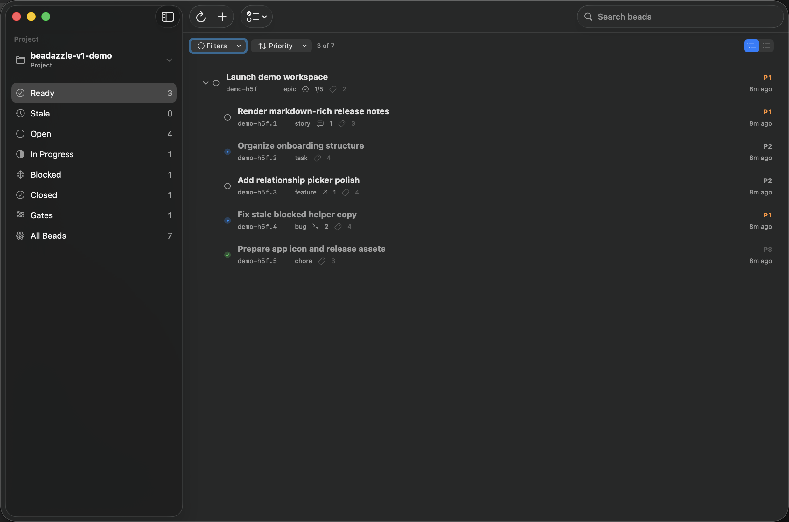
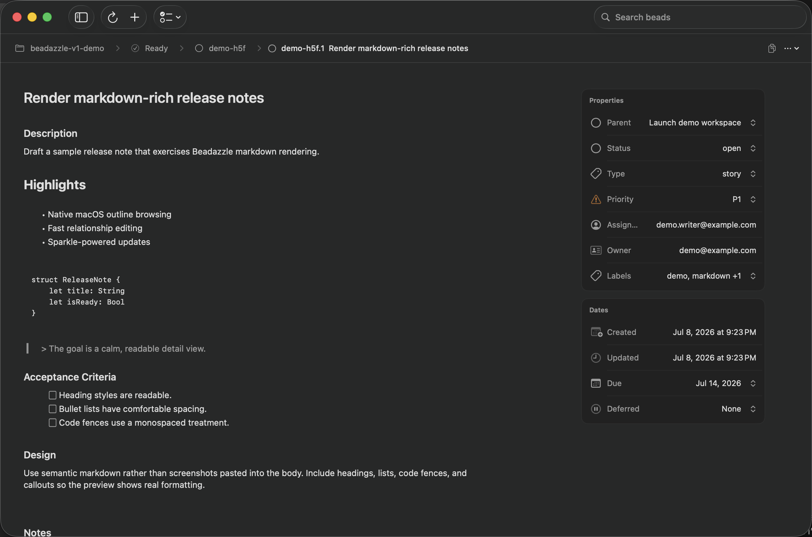
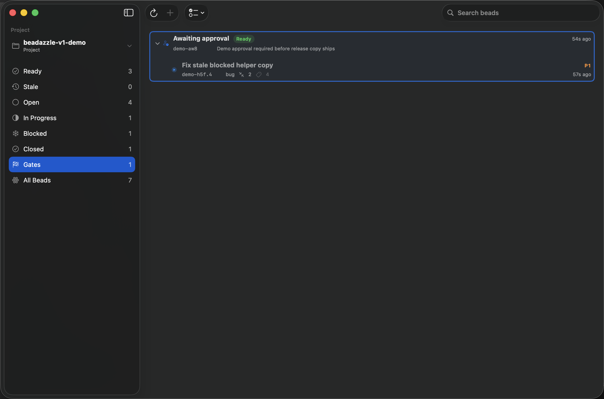

# Beadazzle

<p align="center">
  
</p>

Beadazzle is a native macOS app for working with Beads issue trackers, especially repositories that use Beads in embedded mode.

The goal is a faster, more human-friendly desktop UI for large Beads projects: quick browsing, search, filtering, sorting, CRUD operations, dependency management, bulk actions, and type/status management without forcing every inspection through the CLI.

Beadazzle is set up for stable distribution through GitHub Releases, including a signed and notarized macOS `.dmg` release path and Sparkle-powered updates.

## Screenshots

These screenshots use a freshly generated synthetic Beads project; they do not contain private project data.







## Install

1. Download the latest `Beadazzle-<version>.dmg` from [GitHub Releases](../../releases).
2. Open the disk image and drag `Beadazzle.app` into `/Applications`.
3. Launch the app and open a local repository that contains Beads data.

The published DMG is intended to be `Developer ID` signed, notarized, and stapled. If you are running a local ad-hoc build instead of a release artifact, Gatekeeper validation will not pass.

## Current Features

- Native macOS SwiftUI app with a sidebar, issue list, and detail pane.
- Opens current Dolt-backed Beads projects in embedded, server, and shared-server modes.
- Reopens the last selected Beads project when available.
- Fast issue browsing with search, filters, outline mode, sort controls, and multi-selection.
- Split list/detail navigation with a full-page detail mode, Back/Forward support, and native context menus.
- Detail editing for title, description, design, acceptance criteria, notes, labels, status, priority, assignee, and dates.
- Live metadata updates for status, priority, labels, assignee, parent, blockers, blocked-by relationships, and deferral dates.
- Dedicated gate queue with approve/reject workflows, gate-aware blockers, and guarded close/reopen actions.
- Parent and sub-issue workflows with breadcrumbs, inline child creation, child-close confirmation, and hierarchy safety checks.
- Fast relationship pickers with search, filters, outline mode, and quick-create flows.
- Project settings for storage, Dolt remote health and manual sync, snapshot freshness, readable export health, optional hooks, backups, and Ready workflow preferences.
- CRUD, bulk actions, comments, dependencies, gates, and workflow mutations routed through the `bd` CLI.
- Context-aware JSONL snapshot reads, including redirected and worktree tracker directories.
- Live reload for local Beads source changes without polling idle projects.
- Sparkle automatic updates with stable and beta channels.
- Local app-bundle and DMG packaging scripts plus GitHub release automation.

## Requirements

- macOS 14 or newer.
- Xcode command line tools or Xcode with SwiftPM support.
- `bd` installed for project discovery and write operations. Set `BEADAZZLE_BD_PATH` if `bd` is outside the app's launch-environment `PATH`.
- A current Dolt-backed Beads project. Beadazzle reads or creates a readable JSONL snapshot in the tracker directory reported by `bd context`.

## Supported Beads Modes

Beadazzle is a desktop client for one current Dolt-backed Beads project at a time. Embedded, server, and shared-server storage modes are supported. Legacy backends, including SQLite-backed projects, are intentionally unsupported.

Beadazzle asks `bd context` for the effective tracker directory before it reads data. This keeps worktree redirects and explicitly routed projects on the same source of truth as the CLI. Supported readable snapshots are:

- `issues.jsonl`
- `beads.jsonl`
- `beads.base.jsonl`

Write support goes through `bd`, not direct file or database writes. Beadazzle currently covers create, edit, close, reopen, delete, bulk status/type/priority updates, labels, assignee, due/defer dates, comments, dependencies, parent/child relationships, custom status/type definitions, explicit Dolt pull/push, optional hooks install, backup sync, and common gate workflows.

Beadazzle asks `bd` to export a fresh readable JSONL snapshot after mutations and manual refreshes. Server-backed projects also export when opened and refresh when the app becomes active, without background polling. The app then reloads that snapshot so Beads remains the source of truth for validation, hooks, history, and storage semantics.

Project Storage settings show the resolved storage mode, tracker directory, configured Dolt remotes, automatic-push policy, readable snapshot, Git integration, backup destination, and Beads role. Pull and Push are explicit actions; Beadazzle does not synchronize in the background. Git hooks are presented as optional integration, and stealth projects hide hook actions that do not apply. Contributor routing is shown for clarity while creation and gate commands remain delegated to `bd`, which chooses the configured planning repository.

Generally not implemented in v1:

- Full Beads administration for every `bd config`, storage, migration, import, export, federation, or recovery command.
- Creating, editing, or removing Dolt remotes and changing automatic-push policy.
- Direct editing of `.beads` internals, Dolt tables, Beads history, or generated JSONL snapshots.
- Built-in `bd` distribution, remote workers, agent orchestration, or hosted/team/cloud Beads service features.
- Git, GitHub, pull request, or CI management beyond displaying and acting on Beads data that already exists locally.
- Comment editing/deletion and advanced gate maintenance beyond the common create, check, approve/reject, resolve, and waiter flows.
- Multi-project dashboards, cross-repository search, and multi-user collaboration surfaces.

## Build, Test, and Run

Repo-local `rtk` commands are the preferred entrypoints in this project:

```bash
rtk swift build
rtk swift test
rtk ./script/build_and_run.sh
```

Useful launch modes:

```bash
rtk ./script/build_and_run.sh --verify
rtk ./script/build_and_run.sh --logs
rtk ./script/build_and_run.sh --telemetry
rtk ./script/build_and_run.sh --debug
```

If you are not using `rtk`, the equivalent raw commands are `swift build`, `swift test`, and `./script/build_and_run.sh`.

`script/build_and_run.sh` remains the single local build/run entrypoint. It builds the SwiftPM executable, stages `dist/Beadazzle.app`, applies an ad-hoc signature for local launch, and opens the app through LaunchServices.

Generated output lives under `.build/`, `.swiftpm/`, and `dist/`; those paths are ignored and should not be edited manually.

## Release Packaging

Local release helpers live under `script/`:

```bash
./script/test_release_common.sh
./script/build_app_bundle.sh --release-tag v1.0.0 --build-number 100
./script/create_release_dmg.sh --release-tag v1.0.0 --build-number 100
```

- `build_app_bundle.sh` assembles `dist/Beadazzle.app` with tag-derived bundle metadata.
- `create_release_dmg.sh` builds `dist/Beadazzle-<version>.dmg` plus a `.sha256` checksum and verifies the mounted image contents.
- `notarize_release.sh` submits the signed app bundle or DMG to Apple, staples the result, re-validates Gatekeeper checks, and refreshes the DMG checksum after stapling.
- `.github/workflows/release.yml` runs the same scripts for tag pushes or manual release dispatches.

See [`docs/releasing.md`](docs/releasing.md) for the maintainer release checklist and required GitHub secrets.

## Data Access, Writes, and Privacy

Beadazzle is designed around local repository data.

- Reads come from the JSONL snapshot in the tracker directory reported by `bd context`.
- When the app needs a readable snapshot after a mutation, it asks `bd` to export one and then reloads that snapshot.
- Remote issue synchronization is user-initiated and routes through `bd dolt pull` and `bd dolt push`; source-code Git operations remain separate.
- Create, update, close, delete, dependency, comment, gate, and workflow-definition changes go through the `bd` CLI. Beadazzle does not write directly to Dolt tables or Beads JSONL records.
- Beadazzle does not ship with `bd`; you must install it separately for write actions.
- The app does not enable remote telemetry, analytics, or crash reporting by default.
- Optional diagnostics are local-only: `--logs` and `--telemetry` stream macOS unified logs on your machine, and the performance signposts are only visible if you intentionally inspect them with Apple developer tools.

## Credits and Inspiration

- Architectural inspiration: [`beads_viewer`](https://github.com/Dicklesworthstone/beads_viewer) by Dicklesworthstone.
- Design inspiration: [Linear](https://linear.app), especially its focused issue-tracking workflows and calm, dense interface patterns.
- Open-source dependencies and bundled license notes are tracked in [Third-Party Notices](THIRD_PARTY_NOTICES.md).

## Governance and Policies

- [License](LICENSE)
- [Contributing](CONTRIBUTING.md)
- [Security](SECURITY.md)
- [Third-Party Notices](THIRD_PARTY_NOTICES.md)
- [Maintainer Release Guide](docs/releasing.md)

## Manual QA

Close reason dialog:

- Launch with `rtk ./script/build_and_run.sh --verify`.
- Open a Beads project, close one bead from the row context menu, and confirm the reason field is focused.
- Cancel the dialog and confirm the bead remains open.
- Close one bead with a blank reason and confirm the app refreshes without an error.
- Close one bead with a typed reason and confirm the app refreshes without an error.
- Select multiple beads, choose `Bulk Actions > Close Selected...`, enter a reason, and confirm all selected beads close.

## Architecture

- `Sources/Beadazzle/App`: app entrypoint and commands.
- `Sources/Beadazzle/Models`: Beads issue, dependency, draft, and sorting models.
- `Sources/Beadazzle/Stores`: app state, filtering, selection, history, and mutation coordination.
- `Sources/Beadazzle/Services`: context-aware JSONL snapshot reads, live source monitoring, `bd` command execution, and native panels.
- `Sources/Beadazzle/Views`: SwiftUI surfaces for sidebar, list, detail, editor, dependencies, and bulk actions.
- `Sources/Beadazzle/Support`: formatting, notifications, performance signposts, and visual styling helpers.

Reads are optimized for UI responsiveness: Beadazzle discovers one local source, loads a full snapshot off the main thread, builds an immutable project index, and keeps views querying that in-memory index. Writes go through `bd` instead of direct database mutation so Beads semantics, hooks, history, and validation remain intact.
